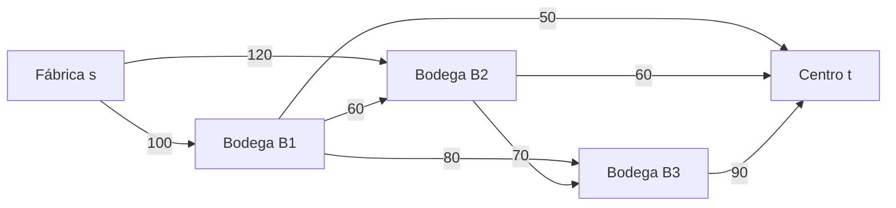

# Caso 3 — Cadena de Suministro

Implementación en Java del algoritmo **Edmonds–Karp** para hallar el flujo máximo desde una fábrica hasta un centro de distribución, atravesando bodegas regionales con capacidades limitadas.

El resultado del caso es **200 unidades por día**.

## Contenido

- `src/`: implementación de la red residual y Edmonds–Karp.
- `test/`: pruebas autocontenidas ejecutables sin dependencias externas; verifican
  el resultado, las capacidades, la conservación, el corte mínimo y el uso de una
  arista residual inversa.
- `docs/informe_tecnico.md`: informe para la entrega.
- `docs/analisis_del_flujo.md`: cálculo manual, red residual y corte mínimo.
- `presentacion_piense.md`: presentación final sin código, centrada en el
  razonamiento y en el ejemplo construido.
- `presentation.md`: guía técnica complementaria de exposición.

## Requisitos

- Java 11 o posterior.

## Compilar y ejecutar

Desde la raíz del repositorio:

```bash
mkdir -p bin
javac -d bin src/com/upb/supplychain/*.java
java -cp bin com.upb.supplychain.SupplyChainApp
```

La aplicación imprime los caminos aumentantes, sus cuellos de botella, el flujo
final de cada tramo y el corte mínimo calculado desde la red residual final.

## Ejecutar pruebas

```bash
javac -d bin src/com/upb/supplychain/*.java test/com/upb/supplychain/EdmondsKarpTest.java
java -cp bin com.upb.supplychain.EdmondsKarpTest
```

## Modelo de la red

| Nodo | Identificador | Rol |
|---|---:|---|
| Fábrica | `s` / 0 | Fuente |
| Bodega 1 | `B1` / 1 | Bodega regional |
| Bodega 2 | `B2` / 2 | Bodega regional |
| Bodega 3 | `B3` / 3 | Bodega regional |
| Centro de distribución | `t` / 4 | Sumidero |



## Diseño

Cada arista física tiene una arista residual inversa de capacidad inicial cero. Cuando se aumentan `x` unidades por una arista, su flujo incrementa en `x` y el flujo de su inversa disminuye en `x`; así la inversa obtiene capacidad residual `x` y permite corregir decisiones anteriores si fuera necesario.

Edmonds–Karp usa BFS para elegir el camino aumentante con menor número de aristas. Su complejidad es `O(V E²)`.

## Resultado y validación

El programa obtiene flujo 200. Las tres entradas al centro suman exactamente `50 + 60 + 90 = 200`; por lo tanto, ese corte s–t tiene capacidad 200. Como existe un flujo de valor 200 y un corte de capacidad 200, por el teorema de flujo máximo–corte mínimo, el resultado es óptimo.
