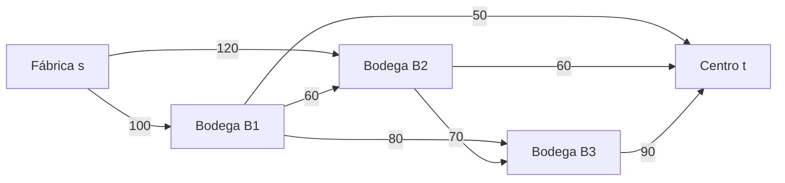

# Caso 3 — Cadena de suministro

## Redes de flujo en un problema real
---

# 1. ¿Qué queremos optimizar?

Una fábrica debe enviar productos a un centro de distribución. Los productos pueden pasar por varias bodegas regionales y cada tramo admite una cantidad limitada por día.

> **¿Cuál es la mayor cantidad de productos que puede llegar diariamente al centro sin superar ninguna capacidad de transporte?**

## Nuestro ejemplo

- La **fábrica** es el origen de los productos.
- El **centro de distribución** es el destino final.
- B1, B2 y B3 son bodegas intermedias.
- Cada flecha es una ruta de transporte.
- Cada número es su capacidad máxima diaria.

---

# 2. ¿Cómo convertimos el problema en una red?

- La fábrica es la **fuente** `s`.
- El centro es el **sumidero** `t`.
- Las bodegas son nodos intermedios.
- Las rutas son aristas dirigidas.
- Los límites diarios son las capacidades.
## Modelo de la red

| Nodo | Identificador | Rol |
|---|---:|---|
| Fábrica | `s` / 0 | Fuente |
| Bodega 1 | `B1` / 1 | Bodega regional |
| Bodega 2 | `B2` / 2 | Bodega regional |
| Bodega 3 | `B3` / 3 | Bodega regional |
| Centro de distribución | `t` / 4 | Sumidero |



# 3. ¿Qué hace válido a un flujo?

Un flujo es factible si cumple:

1. **Capacidad:** ninguna ruta transporta más de lo permitido.
2. **Conservación:** en cada bodega, todo lo que entra también sale.

## Nuestro ejemplo: flujo factible de 110

- Enviamos 50 por `s → B1 → t`.
- Enviamos 60 por `s → B2 → t`.

| Bodega | Entrada | Salida | ¿Conserva? |
|---|---:|---:|---|
| B1 | 50 | 50 | Sí |
| B2 | 60 | 60 | Sí |
| B3 | 0 | 0 | Sí |

Todas las rutas respetan su capacidad. Por eso, 110 es factible, aunque todavía no sabemos si es máximo.

---

# 4. ¿Qué posibilidades quedan?

La **red residual** muestra cuánto flujo adicional puede enviarse y cuánto flujo anterior puede cancelarse.

- Residual directa: `capacidad − flujo`.
- Residual inversa: `flujo enviado`.

La arista inversa no representa necesariamente un camión viajando en sentido contrario. Representa la posibilidad de **corregir una asignación anterior**.

## Nuestro ejemplo después de enviar 110

| Ruta | Residual directa | Residual inversa |
|---|---:|---:|
| s → B1 | 50 | B1 → s: 50 |
| s → B2 | 60 | B2 → s: 60 |
| B1 → B2 | 60 | B2 → B1: 0 |
| B1 → B3 | 80 | B3 → B1: 0 |
| B1 → t | 0 | t → B1: 50 |
| B2 → B3 | 70 | B3 → B2: 0 |
| B2 → t | 0 | t → B2: 60 |
| B3 → t | 90 | t → B3: 0 |

Las entregas directas desde B1 y B2 están saturadas, pero todavía se puede llegar al centro pasando por B3.

---

# 5. ¿Cuánto podemos aumentar?

Un **camino aumentante** va de `s` a `t` usando aristas con residual positivo. Su **cuello de botella** es la menor capacidad residual del camino.

## Nuestro ejemplo

| Paso | Camino | Residuales | Cuello | Acumulado |
|---:|---|---|---:|---:|
| 1 | s → B1 → t | 100, 50 | 50 | 50 |
| 2 | s → B2 → t | 120, 60 | 60 | 110 |
| 3 | s → B1 → B3 → t | 50, 80, 90 | 50 | 160 |
| 4 | s → B2 → B3 → t | 60, 70, 40 | 40 | 200 |

En el último camino solo se agregan 40 porque eso era lo que quedaba disponible en `B3 → t`.

---

# 6. ¿El flujo final es factible?

## Nuestro ejemplo

| Ruta | Flujo/capacidad |
|---|---:|
| s → B1 | 100/100 |
| s → B2 | 100/120 |
| B1 → B2 | 0/60 |
| B1 → B3 | 50/80 |
| B1 → t | 50/50 |
| B2 → B3 | 40/70 |
| B2 → t | 60/60 |
| B3 → t | 90/90 |

Conservación:

- B1 recibe 100 y entrega `50 + 50 = 100`.
- B2 recibe 100 y entrega `40 + 60 = 100`.
- B3 recibe `50 + 40 = 90` y entrega 90.

El centro recibe `50 + 60 + 90 = 200 unidades por día`.

---

# 7. ¿Cómo demostramos que 200 es el máximo?

Usamos un **corte s–t**: separamos la fuente del sumidero y sumamos las capacidades de las rutas que cruzan hacia el sumidero.

## Nuestro ejemplo

```text
S = {s, B1, B2, B3}
T = {t}
```

Cruzan el corte:

- `B1 → t`: 50.
- `B2 → t`: 60.
- `B3 → t`: 90.

`Capacidad del corte = 50 + 60 + 90 = 200`.

Construimos un flujo de 200 y encontramos un corte que impide transportar más de 200. Por el teorema de flujo máximo–corte mínimo:

> **El flujo máximo es 200 unidades por día.**

---

# 8. ¿Qué significa para el negocio?

La fábrica puede despachar inicialmente hasta 220 unidades por sus dos salidas, pero el centro solo puede recibir 200 por sus tres entradas.

## Conclusión de nuestro ejemplo

- El cuello de botella global está en las entradas al centro.
- Aumentar solamente `s → B1` o `s → B2` no elevaría el máximo.
- Para superar 200 hay que ampliar al menos una entrada al centro.
- La ampliación también necesitaría capacidad suficiente en las rutas anteriores.

> La red actual transporta de manera factible y óptima **200 unidades por día**.

---

# Preguntas para la defensa

1. ¿Por qué 110 es factible pero no máximo?
2. ¿Qué representa una arista residual inversa?
3. ¿Cómo se calcula el cuello de botella?
4. ¿Por qué `B1 → B2` termina con flujo cero?
5. ¿Qué rutas forman el corte de capacidad 200?
6. ¿Por qué ampliar solamente las salidas de la fábrica no mejora el resultado?
7. ¿Qué tendría que cambiar para transportar más de 200 unidades por día?
